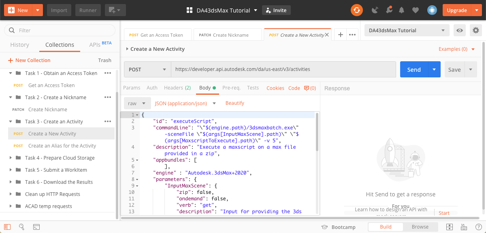
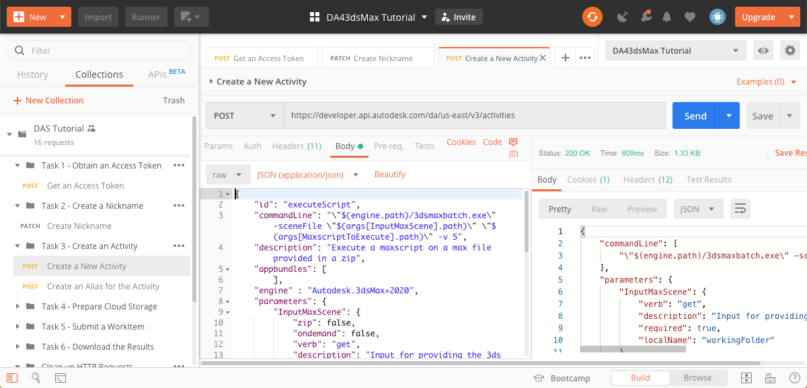
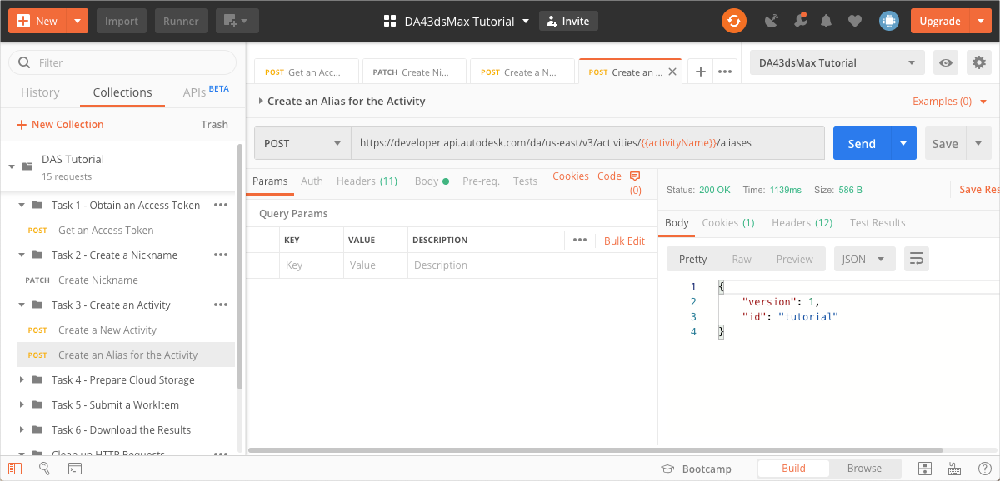

# Create an Activity

An Activity is an action that can be executed in Design Automation. You create and post Activities to run specific AppBundles.

## Create a New Activity

1. On the Postman sidebar, click **Task 3 -Create an Activity > POST Create a New Activity**. The request loads.

2. Click the **Body** tab. Observe the body parameters.

    

**Notes**
 - `id` is the name given to the new Activity. 
 - `commandLine` is the command run by this Activity. The variables used in the command line are replaced with actual values before executing the Activity. This mechanism lets you replace file path(s) you used in the command line testing locally, with file paths that makes sense in the Design Automation environment.

    The variables used in this HTTP request are:

    - `$(engine.path)` - The full path to the  folder containing *3dsmaxbatch.exe*.  The variable``$(engine.path)`` will be replaced by the path to where the engine is installed. The engine is defined in the request body as "engine": "Autodesk.3dsMax+2019. **Do not edit or alter this commandLine in the request body of Activity posts.** 

    - ` $(args[InputMaxScene].path)` - Will be replaced by the path to a file specified by a parameter named InputMaxScene.

    -  `$(args[MaxscriptToExecute].path)` - Will be replaced by the path to a file specified by a parameter named MaxscriptToExecute.

3. Click **Send**. If the request is successfull, you should see a screen similar to the following image.

    

## Create an Alias to the Activity

Design Automation does not let you reference an Activity by its `id`. You must always reference an Activity by an alias.  Note that an alias points to a specific version of an Activity and not the Activity itself.

To create an alias named `tutorial`, which refers to version `1` of the `ExecuteMaxscript` Activity:

1. On the Postman sidebar, click **Task 3 -Create an Activity > POST Create an Alias to the Activity**. The request loads.

2. Click **Send**. If the request is successfull, you should see a screen similar to the following image.

    

[:arrow_backward:](task-2.md)  [:arrow_up_small:](../readme.md)  [:arrow_forward:](task-4.md)