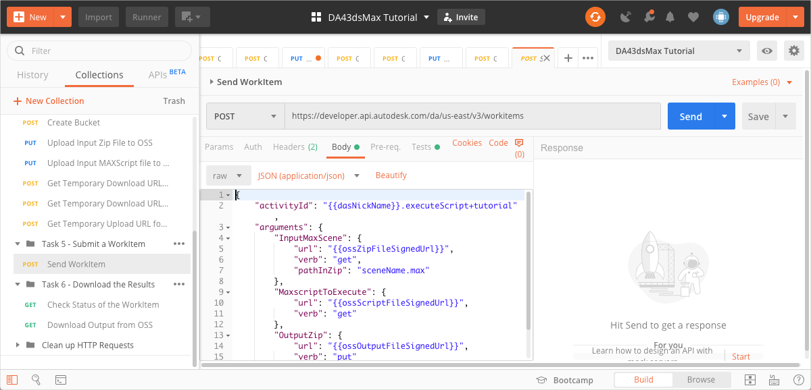
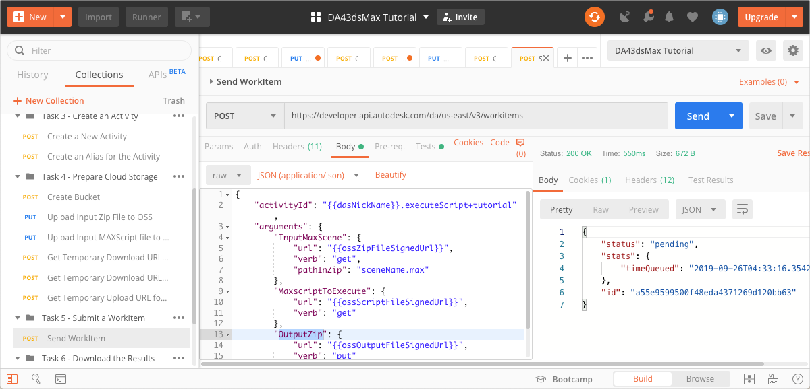

# Task 7 - Submit a WorkItem

When you submit a WorkItem to Design Automation, you are instructing Design Automation to execute the Activity specified in the WorkItem.

## Create a WorkItem

1. On the Postman sidebar, click **Task 7 - Submit a WorkItem > Create a WorkItem**. The request loads.

2. Click the **Body** tab and and take note of the JSON payload.

    

    The main attributes are:

    - `activityId` - Specifies what Activity to execute. The `activityId`  consists of 3 parts.  It starts with the Nickname of the Forge App. This is followed by the '.' character, which in turn is followed by the Activity name. This is followed by the '+' character and finally the Activity Alias.

    - `arguments` - Contains all the parameters that need to be passed to the Activity specified by `activityId`. They must match the parameters you specified in Task 3, when you created the Activity.

    - `InputMaxScene` - Specifies how to obtain the 3ds Max scene file for the Activity. It contains the signed URL to the zip file containing the 3ds Max scene, which we obtained in Task 4. This is followed by the HTTP verb that gets the file. The `pathInZip` attribute specifies the relative path to the 3ds Max file within the zip file. In task 4, if you opted to upload a 3ds Max file and not a zip file, do not specify the `pathInZip` attribute.

    - `MaxscriptToExecute`- Specifies how to obtain the MAXScript file for the Activity. Contains the signed URL to download the MAXScript file.

    - `OutputZip` -   Specifies the signed URL to the location reserved for the output of the acticity, followed by the HTTP verb to use.

3. Click **Send**. If the request is successfull you should see a screen similar to the following image.

    

## Check Status of a WorkItem

Design Automation WorkItems are queued before they are processed. Processing itself can take time. Once processing is done, you need to know if the WorkItems ran successfully or not. As such it is important for you to check the status of the WorkItem you created.

1. On the Postman sidebar, click **Task 7 - Submit a WorkItem > Check Status of a WorkItem**. The request loads.

2. Click **Send**. You should see a screen similar to the following image.

    

[:arrow_backward:](task-4.md)  [:arrow_up_small:](../readme.md)  [:arrow_forward:](task-6.md) 