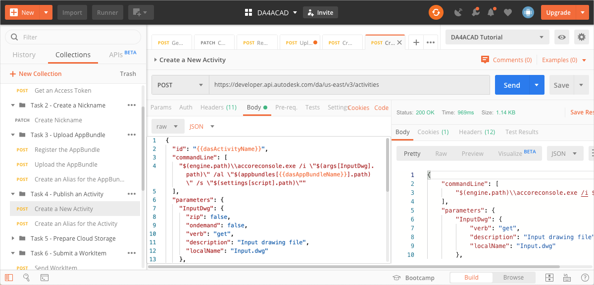

# Task 5 - Create an Activity

An Activity is an action that can be executed in Design Automation. You create and post Activities to run specific AppBundles.

## Create a New Activity

1. On the Postman sidebar, click **Task 4 - Create an Activity > POST Create a New Activity**. The request loads.

2. Click the **Body** tab. Observe the body parameters.

    

**Notes**
 - `id` is the name given to the new Activity. The id is picked up from the Postman Environment Variable `dasActivityName`. 
 - `commandLine` is the command run by this Activity. It consists of several variables. These variables are replaced by actual values at the time the Activity is executed. This mechanism provides the ability to test the command line locally with file paths that are applicable to Design Automation. For more information, see the [Forge portal documentation on command lines](https://forge.autodesk.com/en/docs/design-automation/v3/developers_guide/field-guide/#command-lines).

    - `$(engine.path)\\accoreconsole.exe` - The full path to the AutoCAD engine. The version of AutoCAD to be used is defined in the request body as `"engine": "Autodesk.AutoCAD+22`.  

    - `$(args[InputDwg].path)` - The full path to the folder that the file identified by the parameter InputDwg (by the WorkItem that invokes this Activity) is downloaded to. 

    - `$(appbundles[{{dasAppBundleName}}].path)` identifies the path to where the specified AppBundle is unzipped to. The AppBundle is specified in the request body as `"appbundles": [ "{{dasNickName}}.{{dasAppBundleName}}+{{dasAppBundleAlias}}"]`. Note the use of Postman Variables to specify the Nickname, AppBundle Id, and AppBundle Version Alias.

    - `$ (settings[script].path` identifies the path to the file where Design Automation saves the value of the setting named `script`. See [AutoCAD documentation on scripts](https://help.autodesk.com/view/ACD/2020/ENU/?guid=GUID-95BB6824-0700-4019-9672-E6B502659E9E)` for information on writing scripts.

- `parameters` defines the inputs nd outputs that need to be provided when the Activity is executed. Input parameters are identified by the attribute `"verb":"get". Output parameters are identified by the attribute `"verb":"put"`. 

 - `engine` is the Design Automation engine that the Activity (AutoCAD 2020 in this case) runs on.

 - `settings` specifies the command script to be run by the activity. In this case, it calls the custom command TEST. 

3. Set the `dasActivityName` Postman Variable to `ListLayerActivity`.

    1. Click the **Environment quick look** icon on the upper right corner of Postman.

    2. In the **CURRENT VALUE** column, in the **dasAppBundleName** row, enter ListLayers.

    3. Click the **Environment quick look** icon again.

3. Click **Send**. If the request is successful, you should see a screen similar to the following image.

    

## Create an Alias to the Activity

Design Automation does not let you reference an Activity by its `id`. You must reference an Activity by an alias.  Note that an alias points to a specific version of an Activity and not just the Activity itself.

To create an alias named `my_current_version`, which refers to version `1` of the `ListLayersActivity`:

1. On the Postman sidebar, click **Task 4 - Create an Activity > POST Create an Alias to the Activity**. The request loads. 

2. Click the **Body** tab, and observe how the alias id has been set to `my_current_version`. 

3. Click **Send**. If the request is successful, you should see a screen similar to the following image.

    

[:rewind:](../readme.md "readme.md") [:arrow_backward:](task-3.md "Previous task") [:arrow_forward:](task-5.md "Next task")
