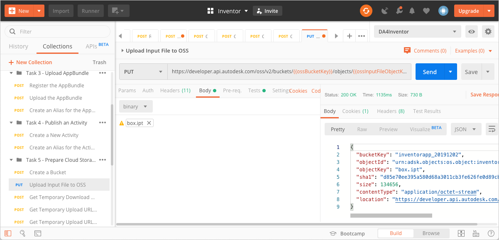
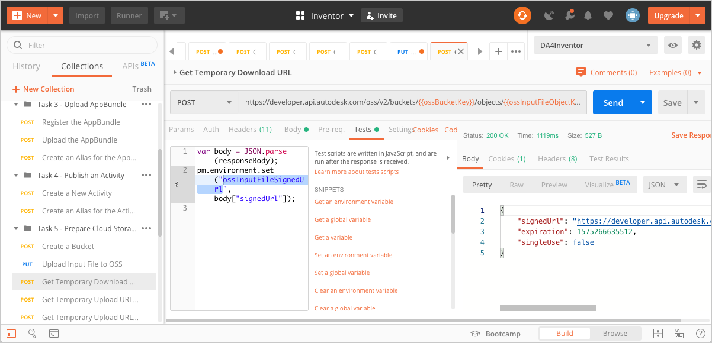

# Task 5 - Prepare cloud storage

The Activity ListLayersActivity takes a dwg file as an input, extracts layer names from it, and produces a text file containing the layer names as output. In this task, we prepare the cloud storage to hold these files. While you can use any cloud storage service for this purpose, this tutorial uses the Object Storage Service (OSS) through the Forge Data Management API.

There are three Postman Environment Variables you must specify for this task. They are
- `ossBucketKey` - The Bucket Key for the Bucket that holds your files in the cloud.
- `ossOutputFileObjectKey` - The Object Key of the placeholder for the output file that the add-in produces.

## Create a Bucket

1. Click the **Environment quick look** icon on the upper right corner of Postman.

2. In the **CURRENT VALUE** column, in the **ossBucketKey** row, specify a name the Bucket that stores your files.

    **Notes:**  
    - The Bucket name needs to be unique throughout the OSS service. At the time you create a Bucket, you may need to change the value of this variable if a Bucket with the name you specified already exists.

    - The Bucket name must consist of only lower case characters, the numbers 0-9, and the underscore (_) character.

3. Click the **Environment quick look** icon to hide the variables.

4. On the Postman sidebar, click **Task 5 - Prepare Cloud Storage > POST Create a Bucket**. The request loads.

5. Click **Send**. If the request is successful, you should see a screen similar to the following image.

    

## Upload input file to OSS

1. Download the input file, *Mechanical - Multileaders.dwg* from the [*tutorial_data* folder of this repository](../tutorial_data).

2. Click the **Environment quick look** icon on the upper right corner of Postman.

3. In the **CURRENT VALUE** column, in the **ossDwgFileObjectKey** row, specify an Object Key (a name to identify the input file, once it is uploaded to OSS).

4. Click the **Environment quick look** icon to hide the variables.

5. On the Postman sidebar, click **Task 5 - Prepare Cloud Storage > PUT Upload Input File**. The request loads.

6. Click the **Body** tab.

7. Click **Select File** and pick the file you downloaded in step 1.

    

8. Click **Send**. If your request is successful, you should see a screen similar to the one below:

    

## Get temporary download URL

Design Automation needs to download the input file to process it. This request obtains a temporary signed URL that Design Automation can use to download the file, and saves it to a Postman Environment Variable. The URL expires in an hour.

1. On the Postman sidebar, click **Task 5 - Prepare Cloud Storage > POST Get Temporary Download URL**. The request loads.

2. Click **Send**. If the request is successful, you should see a screen similar to the following image. Furthermore, the signed URL is saved to the `ossDownloadURL` Postman Environment Variable.

    

## Get temporary upload URL

Design Automation needs a signed URL to upload text file that the ListLayers Activity creates. This request obtains a temporary signed URL that Design Automation can use to upload the file. Postman saves the URL to a Postman Environment Variable.

1. Click the **Environment quick look** icon on the upper right corner of Postman.

2. In the **CURRENT VALUE** column, in the **ossOutputFileObjectKey** row, specify an Object Key (a name to identify the output file, once it is uploaded to OSS).

3. Click the **Environment quick look** icon to hide the variables.

4. On the Postman sidebar, click **Task 5 - Prepare Cloud Storage > POST Get Temporary Upload URL**. The request loads.

5. Click **Send**. If the request is successful, you should see a screen similar to the following image. Furthermore, the signed URL is saved to the `ossUploadURL` Postman Environment Variable.

    

[:rewind:](../readme.md "readme.md") [:arrow_backward:](task-4.md "Previous task") [:arrow_forward:](task-6.md "Next task")
