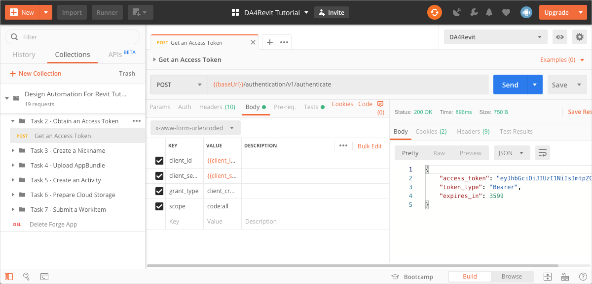

# Task 2 - Obtain an Access Token

## Create a Forge App

1. Follow the instructions on [Get Started with Forge in Three Steps](https://dev.forge.autodesk.com/developer/start-now/signup) 
to create a Forge App. In the *Add Services to Forge* stage, select "Design Automation API V3 (Beta)" and "Data Management API".

2. Jot down the Client ID and Client Secret of the Forge App you created.

## Save Client ID and Client Secret to Postman Environment Variables

In the DA4Revit environment that you selected earlier, there are two Postman Environment Variables named `client_id` and `client_secret`. By setting these variables, you won't need to specify their values when you send HTTP requests to Forge. 

To set the environment variables:

1. Click the **Environment quick look** icon on the upper right corner of Postman. 
   

2. Click **Edit** on the upper right corner. The Manage Environments dialog displays.
   

3. In the **CURRENT VALUE** column, enter the values of the Client ID and Client Secret you jotted down in the previous exercise.
    

4. Click **Update** and close the Manage Environments dialog.

## Get an Access Token

To get an Access Token, you must send an `authenticate` request to Forge. The Postman collection has a prepopulated authenticate request that you can send. To send the request to Forge:

1. On the Postman sidebar, click **Task 2 - Obtain an Access Token > POST Get an Access Token**. The request loads.

2. Click the **Body** tab.

3. Move the cursor over the **Value** column of the **client_id** and **client_secret**, and verify that the values you specified as environment variables are displayed.
    

4. Click **Send**. The request is sent to Forge. If your request authenticates successfully, you should see a response similar to the following:
 

Postman saves the Access Token in the Postman Environment Variable `dasApiToken`. Postman picks up the Access Token from this variable for all subsequent requests, eliminating the need for you to repeatedly specify the value of the token.