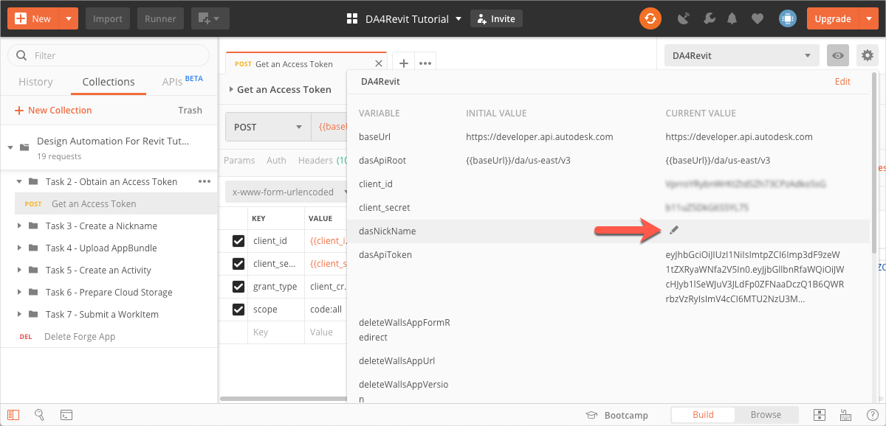
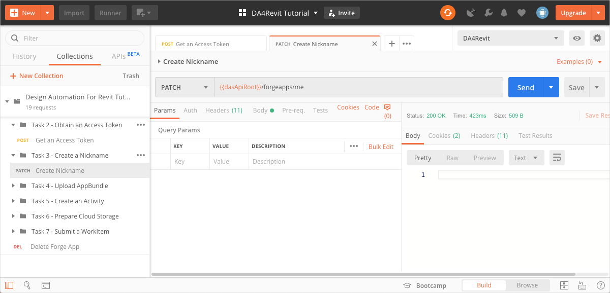

# Task 3 - Create a Nickname

Forge uses the Client ID to uniquely identify an app. The Client ID can be long and cryptic, and hence a source of irritation when you reference the data you add to your app.

A Nickname lets you map a Client ID to an easy-to-use name that you can use in place of the Client ID. This tutotial uses the `dasNickName` Postman Environment Variable to store the Nickname. 

## Save the Nickname to a variable

1. Click the **Environment quick look** icon on the upper right corner of Postman. 

2. Click **Edit** on the upper right corner. The Manage Environments dialog displays.

3. In the **CURRENT VALUE** column, in the **dasNickName** row, enter a Nickname for your app.
   

   **Notes:**

    - If your Forge App doesn't have any data, you can map the Forge App to another nickname, and the new nickname will overwrite the old one. Once your Forge App has data, you cannot ``PATCH`` a nickname for your Forge App anymore. This is true even if you have not yet assigned a nickname for the app. The only way you can assign a nickname to an app with data is by first calling the `[DELETE] /forgeapps/me` endpoint. This deletes all data associated with that app, including the nickname.

    - Nicknames must be globally unique.  If the nickname is already in use, even by someone else, the PATCH request will return a ``409 Conflict`` error.

4. Click **Update** and close the Manage Environments dialog.

## Send a request to set the Nickname

1. On the Postman sidebar, click **Task 3 - Obtain an Access Token > PATCH Create Nickname**. The request loads.

2. Click  **Send**. If the request is sucessful, you should see a response similar to the following image. Note that the response has only a header and no body.
 

[:arrow_backward](task-2.md)  [:arrow_forward:](task-4.md)
