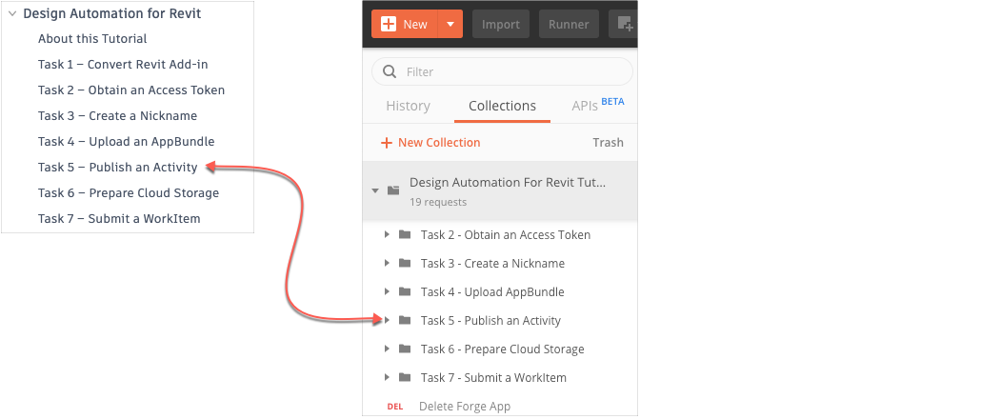
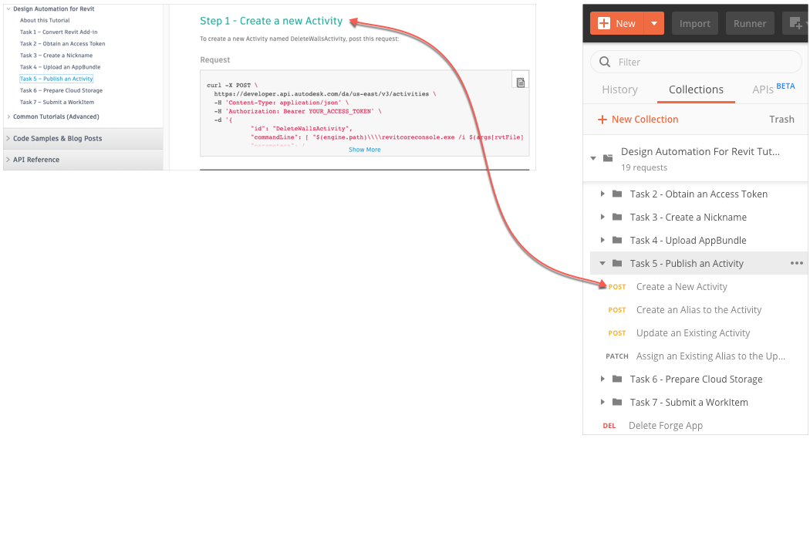

# Design Automation for Revit Step-by-Step Tutorial

This folder contains a Postman Collection that contains the requests used in the [Design Automation for Revit Step-by-Step tutorial](https://dev.forge.autodesk.com/en/docs/design-automation/v3/tutorials/revit-edit/?sha=6120_10) on the Forge Portal. 

On the Postman sidebar, requests are stored in folders that have the same name as the corresponding task in the Forge portal.

Individual requests in Postman have the same names as the correspondong step in the Forge portal.

## Before you Begin...

### 1. Create a Forge App

1. Follow the instructions on [Get Started with Forge in Three Steps](https://dev.forge.autodesk.com/developer/start-now/signup) 
to create a Forge App. In the *Add Services to Forge* stage, select  "Design Automation API V3 (Beta)" and "Data Management API".

2. Jot down the Client ID and Client Secret of the Forge App you created.

### 2. Import the Environment for the Tutorial

1. Download the file *das-prd.postman_environment.json* from the *collections* folder of this repository.

2. Import *das-prd.postman_environment.json*

    1. In the Postman header bar, click **Import**. A dialog displays.

    2. Drag the file you downloaded in step 1 to the area marked **Drop files here**.

3. Click the **Environment drop-down** on the upper-right, and select **das-prd **. The das-prd environment loads.
   

### 3. Import the Postman Collection for the Tutorial.

1. Download the file *Design Automation For Revit Tutorial.postman_collection.json* from  the *collections* folder of this repository.

2. Import *Design Automation For Revit Tutorial.postman_collection*

    1. In the Postman header bar, click **Import**. A dialog displays.

    2. Drag the file you downloaded in step 1 to the area marked **Drop files here**.

### 4. Get a Revit Add-in that is Design Automation Ready 

- On the Forge portal, follow the instructions in the topic [Convert Revit Add-in Task](https://dev.forge.autodesk.com/en/docs/design-automation/v3/tutorials/revit-edit/step1-convert-addin/?sha=6120_10).

or

- Download a Design Automation ready add-in, *DeleteWalls.dll* from [here](/en/docs/design-automation/v3/tutorial_data/DeleteWalls-dll.zip)

