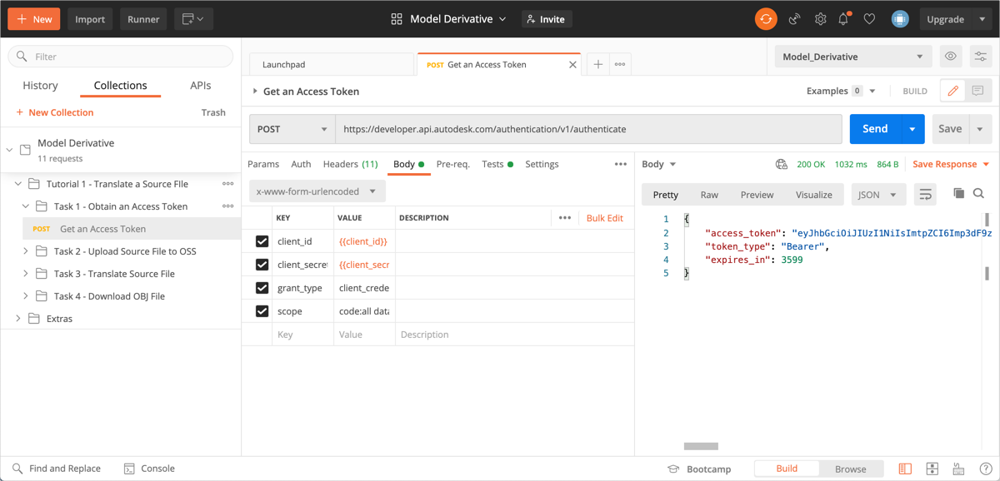

# Task 1 - Obtain an Access Token

## Create a Forge App

1. Follow the instructions on [Get Started with Forge in Three Steps](https://forge.autodesk.com/developer/start-now/signup) 
to create a Forge App. In the *Add Services to Forge* stage, select "Model Derivative API" and "Data Management API".

2. Jot down the *Client ID* and *Client Secret* of the Forge App you created. You will need this in the next step.

## Save Client ID and Client Secret to Postman Environment Variables

In the Model_Derivative environment that you selected earlier, there are two Postman Environment Variables named `client_id` and `client_secret`. By setting these variables, you don't need to specify their values when you send HTTP requests to Forge. 

To set the environment variables:

1. Click the **Environment quick look** icon on the upper right corner of Postman. 

   

2. Click in the **CURRENT VALUE** column on the **client_id** row. The Edit icon displays.

    

3. Click the Edit icon, and enter the *Client ID* you jotted down earlier.

4. Similarly, enter the *Client Secret* you jotted down earlier, in the **CURRENT VALUE** column on the **client_secret** row.

5. Click the **Environment quick look** icon again to close it. 

## Get an Access Token

To get an Access Token, you must send an `authenticate` request to Forge. The Postman Collection has a prepopulated authenticate request that you can send. 

To send the authenticate request to Forge:

1. In the Postman sidebar, click **Task 1 - Obtain an Access Token > POST Get an Access Token**. The request loads.

2. Click the **Body** tab.

3. Move your mouse pointer over the values for **client_id** and **client_secret** in the **VALUES** column, and verify that the values you specified as environment variables are displayed.

    

4. Click **Send**. This sends the HTTP request to Forge. If your request authenticates successfully, you should see a return Status of **200 OK**, and the response will be similar to the following:

     

Postman saves the Access Token in the Postman environment variable `access_token`. Postman will pick up the Access Token from this variable for all subsequent requests, eliminating the need for you to repeatedly specify the value of the token.

[:rewind:](../readme.md "readme.md") [:arrow_backward:](before_you_begin.md "Previous task") [:arrow_forward:](task-2.md "Next task")
