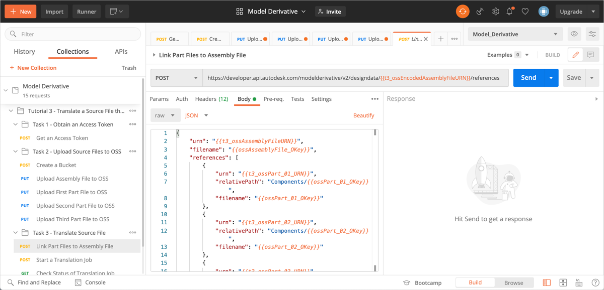
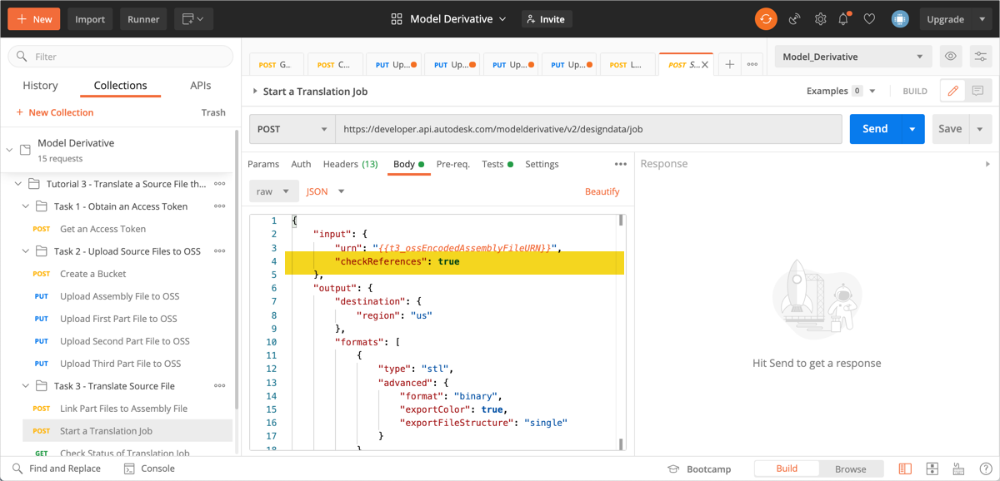
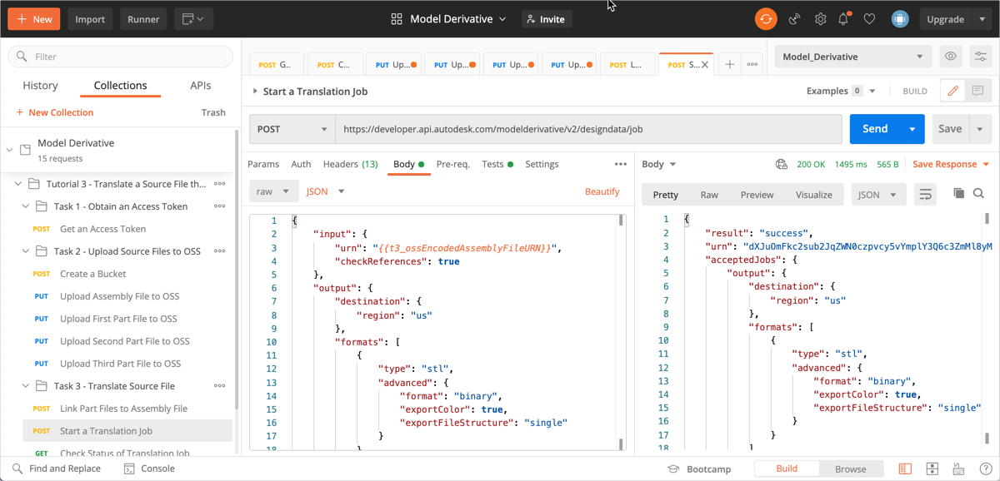
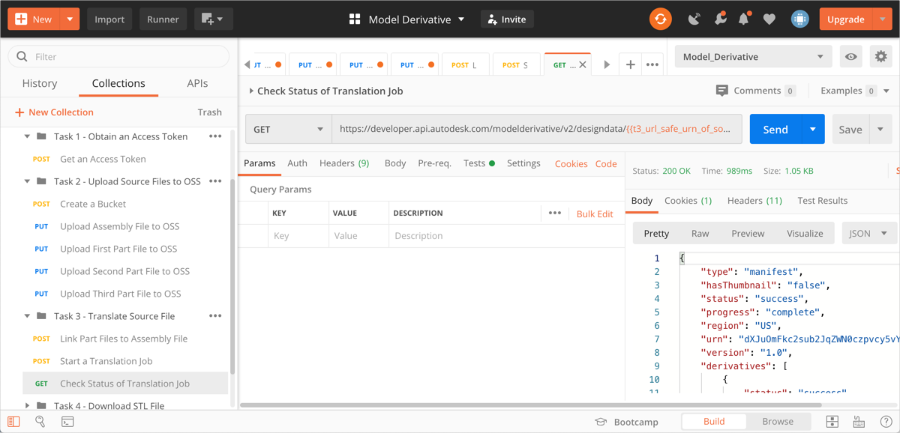

# Task 3 – Translate Source File

You can translate the source file to many different formats (see [Supported Translations](https://forge.autodesk.com/en/docs/model-derivative/v2/developers_guide/supported-translations/) for details). For the purpose of this tutorial, you will translate the source file to the STL format.

To translate a file, you must kick off a translation job. However, before you kick off the translation job, you must link the source file to its references, so that Model Derivative can fetch the referenced files from OSS for translation.

The translation job produces a manifest, which lists all the files that are generated. It also reports how far translation has progressed as a percentage, for each file listed in the manifest.

## Link the assembly file to the referenced part files

The assembly file *scissors.iam* expects its part files to be placed in a sub-folder named *Components*. When you link the part files to the assembly file, you use the `relativePath` attribute in the JSON payload to address this requirement.

1. In the Postman sidebar, click **Task 3 - Translate Source File > POST Link Part Files to Assembly File**. The request loads.

2. Click the **Body** tab.

   

   Note how this request uses a mix of raw URNs, and Base64-Encoded URNs. The URI parameter uses a Base64-Encoded URN while the JSON payload uses the raw URN. Also note the use of the `relativePath` attribute to specify the location of the referenced files (part files) relative to the source file (assembly file).

3. Click **Send**. If the request is successful you should see a screen similar to the following image.

   

## Start a translation job

1. In the Postman sidebar, click **Task 3 - Translate Source File > Start a Translation Job**. The request loads.

2. Click the **Body** tab and take note of the JSON payload.

    

    Note the use of the `checkReferences` attribute to instruct Forge that the source file contains references that must be downloaded at translation time.

3. Click **Send**. If the request is successful you should see a screen similar to the following image.

    

    Note the `urn` attribute in the JSON response. This is the URL-safe Base64 encoded URN of the source file. A script in the **Tests** tab, saves this value to a variable named `t3_url_safe_urn_of_source`.

## Check status of translation job

When you kick off a translation job, it takes time to complete. There are two ways to check if the translation job is done:

- Periodically check the status of the translation job.

- Set up a webhook to notify you when the job is done.

For the purpose of this tutorial you will check the status of the translation job. For more information on webhooks, see the [documentation on Model Derivative webhook events](https://forge.autodesk.com/en/docs/webhooks/v1/reference/events/model_derivative_events)

1. In the Postman sidebar, click **Task 3 - Translate Source File > Check Status of Translation Job**. The request loads.

   

   Note the use of the URL-safe Base64-encoded URN of the source file as a URI parameter (the `t3_url_safe_urn_of_source` variable)

2. Click **Send**. You will see a screen similar to the following image.

   

   When a job is complete, the `progress` attribute becomes `complete`. Repeat this step until the job is complete.

   A script in the **Tests** tab, saves the URN of the OBJ file to a variable named `dv_urn_0`.

[:rewind:](../readme.md "readme.md") [:arrow_backward:](task-2.md "Previous task") [:arrow_forward:](task-4.md "Next task")
