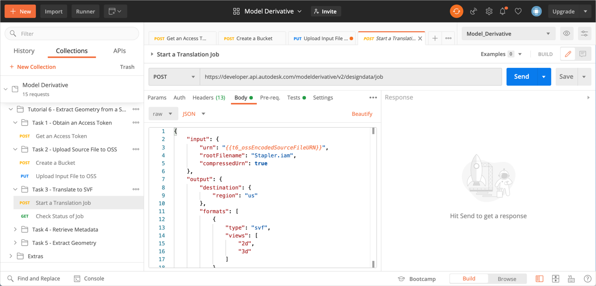
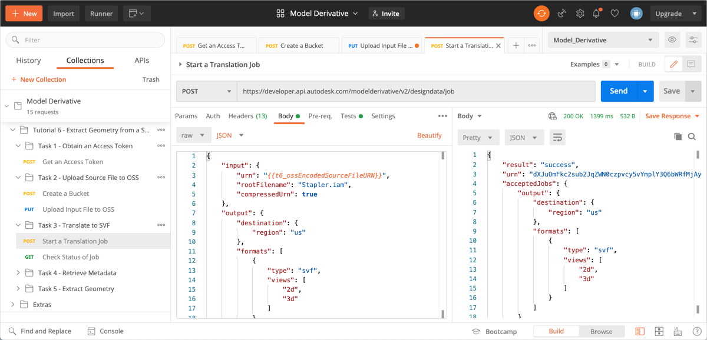
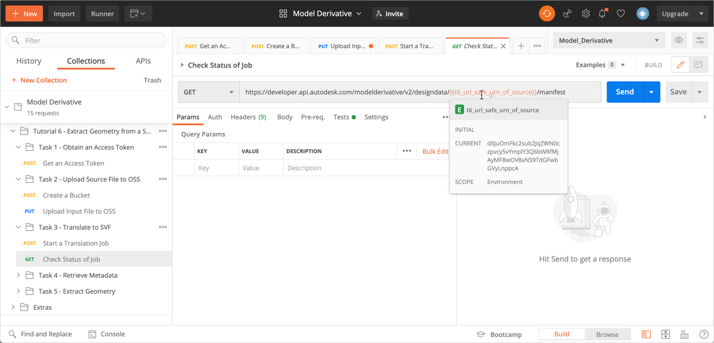

# Task 3 – Translate Source File

In order to extract geometry from a model, the model must first be translated to the SVF format. 

To translate a model, you must kick off a translation job. The translation job produces a manifest, which lists all the files (derivatives) that are generated. It also reports how far translation has progressed as a percentage, for each derivative listed in the manifest.

## Start a translation job

For this task, you will use the Base64-encoded URN of the source file. In the previous task, Postman saved this to the variable `t6_ossEncodedSourceFileURN`, which you will use in the next request.

1. In the Postman sidebar, click **Translate to SVF > Start a Translation Job**. The request loads.

2. Click the **Body** tab and take note of the JSON payload.

    

    Note the name of the Inventor assembly file in the JSON body.

3. Click **Send**. If the request is successful, you should see a screen similar to the following image.

    

    Note the `urn` attribute in the JSON response. This is the URL-safe Base64 encoded URN of the source file. A script in the **Tests** tab, saves this value to a variable named `t6_url_safe_urn_of_source`.

## Check status of translation job

When you kick off a translation job, it takes time to complete. There are two ways to check if the translation job is done:

- Periodically check the status of the translation job.

- Set up a webhook to notify you when the job is done.

For the purpose of this tutorial you will check the status of the translation job. For more information on webhooks, see the [documentation on Model Derivative webhook events](https://forge.autodesk.com/en/docs/webhooks/v1/reference/events/model_derivative_events)

1. In the Postman sidebar, click **Translate to SVF > Check Status of Job**. The request loads.

   

   Note the use of the URL-safe Base64-encoded URN of the source file as a URI parameter (the `t6_url_safe_urn_of_source` variable)

2. Click **Send**. You will see a screen similar to the following image.

   

   Repeat this step until the `progress` attribute becomes `complete`, as shown in the image.

[:rewind:](../readme.md "readme.md") [:arrow_backward:](task-2.md "Previous task") [:arrow_forward:](task-4.md "Next task")
