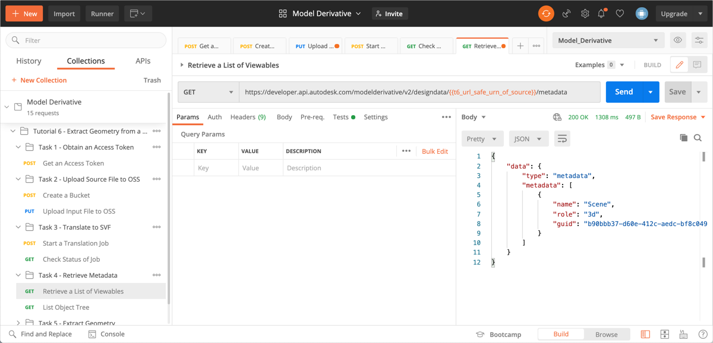
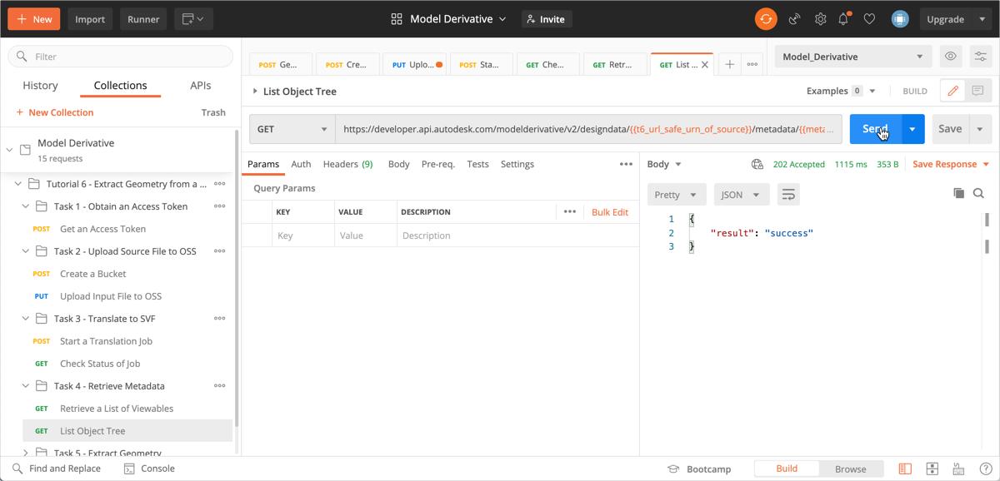
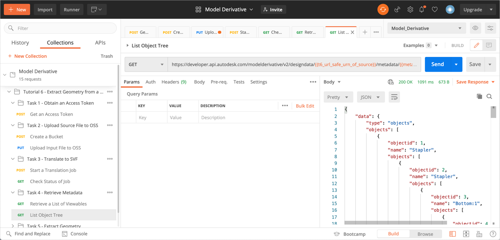

# Task 4 - Extract Metadata

In order to extract geometry, you must know the `objectid` of the geometries to extract. To get the 'objectid' you must first get the metadata GUID of the Viewable that the geometry resides on.

## Retrieve a list of Viewables

In order to obtain a list of Viewables, you will use the URL safe Base64-encoded URN of the source file in the next request. Postman saved this URN to the variable `t6_url_safe_urn_of_source` in the previous task.

1. In the Postman sidebar, click **Task 4 - Retrieve Metadata > Retrieve a List of Viewables**. The request loads.

2. Click **Send**. You should see a screen like the following image.

   

   Note that the model has only one Viewable. (Inventor and Fusion 360 models have only one Viewable. Revit models can have multiple Viewables.) A script in the **Tests** tab saves the metadata GUID of the Viewable to a variable named `metadata_guid_0`.

## Retrieve the Object Tree of Viewable

1. In the Postman sidebar, click **Task 4 - Retrieve Metadata > List Object Tree**. The request loads.

   

   Note the use of the variable `metadata_guid_0` as a URI parameter.

2. Click **Send**. If extracting properties takes time, you will see a screen like the following. 

   

3. Click **Send** again. You should see a screen like the following. 

   

The response body contains the list of object properties.

[:rewind:](../readme.md "readme.md") [:arrow_backward:](task-3.md "Previous task")[:arrow_forward:](task-5.md "Next task")
