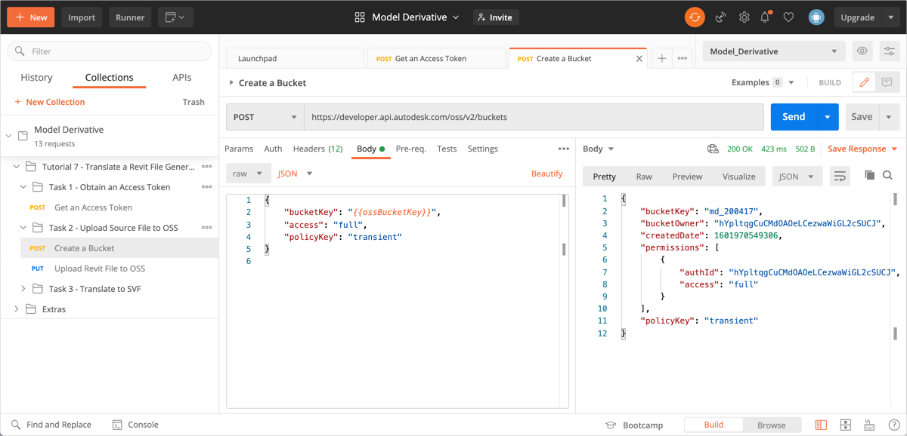

# Task 2 - Upload Source FIle to OSS

The Object Storage Service (OSS) is a generic Cloud Storage Service that is part of the Forge Data Management API. In this task, you upload an Revit file (*rme_advanced_sample_project.rvt*). This is an MEP file that contains space and zone information. This file is available in the [*tutorial_data*](../tutorial_data) folder.

## Create a Bucket

In this tutorial, you will use a Postman environment variable named `ossBucketKey` to hold the Object Key of the Bucket that contains your files in the cloud. If you already have a bucket (from a previous tutorial), carry out step 1, and ignore the rest.

1. Specify a value for the Bucket Key in the Postman Environment Variable named `ossBucketKey`:

    1. Click the **Environment quick look** icon (the eye icon) on the upper right corner of Postman.

    2. In the **CURRENT VALUE** column, in the **ossBucketKey** row, specify a name for the Bucket that stores your files.

        **Notes:**  
        - The Bucket name needs to be unique throughout the OSS service. At the time you create a Bucket, you may need to change the value of this variable if a Bucket with the name you specified already exists.

        - The Bucket name must consist of only lower-case characters, numbers 0-9, and the underscore (_) character.

    3. Click the **Environment quick look** icon to hide the variables.

4. In the Postman sidebar, click **Task 2 - Upload Source File to OSS > POST Create a Bucket**. The request loads.

5. Click the **Body** tab, and verify that the `bucketkey` attribute has been set to the variable `ossBucketKey`.

5. Click **Send**. If the request is successful, you should see a screen similar to the following image.

    

## Upload Revit file to OSS

1. Download the file *rme_advanced_sample_project.rvt* from the [*tutorial_data* folder of this tutorial](../tutorial_data).

2. Set the Postman environment variable `ossSourceFileObjectKey` to `rme_advanced_sample_project.rvt`, which you will use as the Object Key for the assembly file you downloaded in the previous step. 

   1. Click the **Environment quick look** icon (the eye icon) on the upper right corner of Postman.

   2. In the **CURRENT VALUE** column, in the **ossSourceFileObjectKey** row, specify `rme_advanced_sample_project.rvt` as the value for that variable. 

   3. Click the **Environment quick look** icon to hide the variables.

2. In the Postman sidebar, click **Task 2 - Upload Source File to OSS > PUT Upload Revit File to OSS**. The request loads.

    Note the use of `ossBucketkey` and `ossSourceFileObjectKey` as URI parameters.

3. Click the **Body** tab.

4. Click **Select File** and select the file *scissors.iam*, which you downloaded in step 1.

    

5. Click **Send**. This sends the request, and updates the following Postman environment variables:

   | Variable Name                | Description                                                                                                                    |
   |------------------------------|--------------------------------------------------------------------------------------------------------------------------------|
   | t7_ossSourceFileURN          | Value of the `objectId` attribute in the JSON response. This is the URN of the Revit  file *rme_advanced_sample_project.rvt*.  |
   | t7_ossEncodedSourceFileURN   | The URN of the Revit file, converted to a Base64-encoded URN.                                                               |

   You should see a screen similar to the following image:

    

[:rewind:](../readme.md "readme.md") [:arrow_backward:](task-1.md "Previous task") [:arrow_forward:](task-3.md "Next task")
